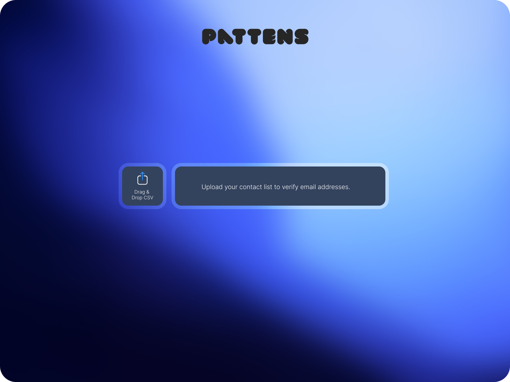

# CSV Email Domain Validator

A simple, beautiful web application that validates email addresses from CSV files by checking MX records and returns a percentage score of valid domains.



## Features

- **Simple Upload**: Drag & drop or click to upload CSV files
- **Fast Validation**: Validates up to 300 emails per upload using MX record checks
- **Clean Results**: Displays a single percentage score with detailed breakdown
- **Beautiful UI**: Modern gradient design with smooth transitions
- **Error Handling**: Graceful error messages for invalid files or formats

## How It Works

1. Upload a CSV file containing email addresses (one per line)
2. The system validates each email's domain by checking for MX records
3. Get instant results showing the percentage of valid email addresses

## Technical Stack

### Frontend
- HTML5
- Tailwind CSS
- Vanilla JavaScript
- Responsive design with beautiful gradient background

### Backend
- Node.js serverless function (Vercel)
- DNS MX record validation
- Handles up to 300 emails per request

## File Structure

```
email-validator/
├── csv-validator.html          # Frontend application
├── api/
│   └── validate-csv.js         # Backend API endpoint
├── Design/                      # UI mockups and assets
├── vercel.json                  # Vercel configuration
├── package.json                 # Node.js dependencies
└── README.md                    # Documentation
```

## CSV Format

Your CSV file should contain one email address per line:

```
john@company.com
jane@business.org
test@example.com
```

**Note**:
- Empty lines are skipped
- Invalid email formats are skipped
- Maximum 300 emails per upload
- Duplicates are automatically removed

## Validation Logic

- **Valid**: Domain has MX records
- **Invalid**: Domain has no MX records
- **Skipped**: Empty lines, invalid formats, duplicates

**Score Calculation**: `(valid emails / total valid email rows) × 100`

## Deployment

### Deploy to Vercel

1. Install Vercel CLI:
   ```bash
   npm install -g vercel
   ```

2. Deploy:
   ```bash
   vercel --prod
   ```

### Local Development

1. Install dependencies:
   ```bash
   npm install -g vercel
   ```

2. Run locally:
   ```bash
   vercel dev
   ```

3. Open http://localhost:3000 in your browser

## API Endpoint

### POST `/api/validate-csv`

**Request:**
- Content-Type: `multipart/form-data`
- Body: CSV file

**Response:**
```json
{
  "total": 100,
  "valid": 87,
  "invalid": 13,
  "percentage": 87.0,
  "skipped": 0
}
```

**Error Responses:**
- `400`: Invalid file format or no emails found
- `400`: File exceeds 300 email limit
- `500`: Server error

## Limitations

- Maximum 300 emails per upload
- MX validation only (does not verify mailbox existence)
- Processing time: ~30-60 seconds for large files
- No authentication required
- Synchronous processing

## License

MIT

## Author

PATTENS
